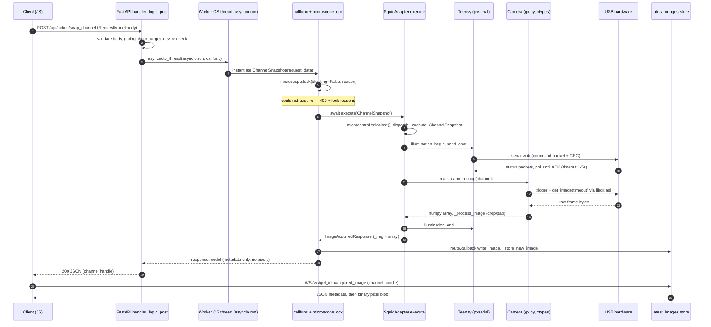
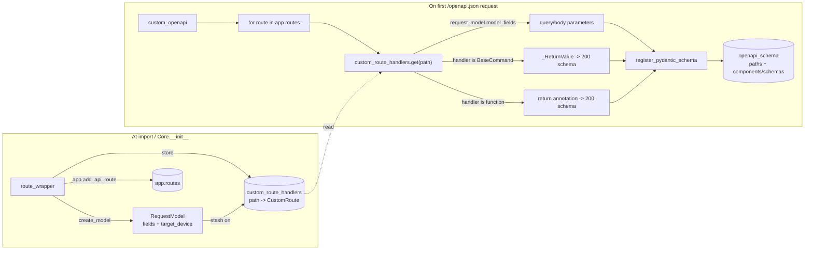

# seafront — backend internals

This directory is the Python package that runs the microscope. It is a headless-first
FastAPI server that talks to hardware (cameras, stage, illumination, autofocus) and serves
a static web UI. This document describes how the code is wired together — the request path,
the (unusual) OpenAPI generation, the concurrency/locking model, and the hardware
abstraction — so you can navigate `__main__.py` without reading all ~2500 lines first.

> For *usage* (how to run, test, lint) see the repo-root `CLAUDE.md`. This file is about
> *how the backend is built*.

## Module map

```
seafront/
├── __main__.py            FastAPI app: all HTTP/WS routes, request plumbing,
│                          acquisition orchestration, custom OpenAPI generator (~2500 lines)
├── logger.py              loguru setup (stderr INFO, ~/seafront/logs/log.txt DEBUG)
├── debug_introspect.py    "where is everybody executing?" thread/task stack dumps
│
├── server/
│   ├── commands.py        Pydantic request/response models + BaseCommand[T] hierarchy
│   └── protocol.py        acquisition protocol: well/site/channel iteration, Z-stacks,
│                          OME metadata, file storage, AsyncThreadPool
│
├── config/
│   ├── registry.py        ConfigRegistry — decentralized config registration
│   ├── handles.py         type-safe enum config keys (no magic strings)
│   ├── core_config.py     GlobalConfigHandler — file I/O, override stack
│   └── basics.py          ConfigItem, ChannelConfig, FilterConfig, ServerConfig ...
│
└── hardware/
    ├── microscope.py      Microscope ABC + Locked[T] wrapper + HardwareLimits
    ├── squid.py           SquidAdapter — real Cephla SQUID implementation
    ├── mock_microscope.py MockMicroscope — synthetic images, simulated motion
    ├── illumination.py    IlluminationController (per-channel calibrated intensity)
    ├── forbidden_areas.py stage keep-out regions
    ├── camera/            Camera ABC + galaxy_camera / toupcam_camera / mock_camera
    └── microcontroller/   Microcontroller ABC + teensy_microcontroller (USB serial)
```

## The application flow

Three data paths share the one `Microscope` instance:

1. **Synchronous commands** — `POST /api/action/*` and `/api/get_*`. Request → thread →
   lock → `execute()` → JSON response. This is the bulk of the API, and the path traced
   below.
2. **Live preview** — `stream_channel_begin` puts the camera in continuous mode; each frame
   is stored into `latest_images`, and the client pulls frames over the
   `/ws/get_info/acquired_image` WebSocket (JSON metadata, then a binary blob).
3. **Background acquisition** — a long-running protocol runs on a dedicated worker event
   loop (`self.acqusition_eventloop`), driven via a command queue, reporting progress over
   `/ws/acquisition/status`.

Here is a *concrete* trace of path 1 — `POST /api/action/snap_channel` (take one image on one
channel) — from the HTTP boundary down to the USB hardware and back. Every hop cites the code
so you can follow it.



What the diagram compresses:

- **Thread-per-request** (`F→W`): each request gets its own OS thread + event loop, required
  for the `RLock` hardware lock (see Concurrency).
- **409 = busy**: `microscope.lock(blocking=False)` failing returns `get_lock_reasons()`,
  naming the command that currently holds the hardware.
- **Microcontroller hop** (`teensy_microcontroller.py`): `illumination_begin` builds a
  fixed-length packet (opcode + args + cmd id + CRC), `send_cmd` writes it over pyserial,
  then polls status packets until the Teensy echoes the matching cmd id — bounded by a 1–5 s
  timeout.
- **Camera hop** (`galaxy_camera.py`): `snap` triggers, then
  `get_image(timeout=exposure+2000ms)` → `gxipy` → `ctypes` → `libgxiapi.so` → USB;
  `_process_image` crops/pads. That timeout is the *only* bound on a hung camera.
- **Pixels return separately**: the HTTP response is metadata only. `write_image` stores the
  array in `latest_images`; the client fetches the downsampled frame as a binary blob over
  `/ws/get_info/acquired_image`, keeping multi-MB data off the JSON path.

### Two hardware transports

| | Microcontroller (stage, illumination, filter wheel) | Camera (main + autofocus) |
|---|---|---|
| Driver | `microcontroller/teensy_microcontroller.py` | `camera/galaxy_camera.py`, `camera/toupcam_camera.py` |
| Transport | pyserial (USB CDC), fixed-length packets + CRC | vendor SDK (`gxipy`/`toupcam`) → `ctypes` → `.so` → USB |
| Call shape | write packet, poll status until matching cmd id | trigger + blocking `get_image(timeout)` or continuous callback |
| Bounded? | yes — ack-poll timeout (1–5 s) | `get_image` yes; **`stream_off`/`unregister_capture_callback` no** |
| Failure handling | `_usb_operation_with_reconnect` decorator (bounded close/reopen retries) | `_camera_operation_with_reconnect` decorator (bounded close/reopen retries) |

The mocks (`mock_microscope.py`, `mock_camera.py`) replace both transports with synthetic
images and simulated motion, so the whole flow runs with no hardware (`--microscope mocroscope`).

## Request routing — `route_wrapper`

Almost every endpoint is registered through `Core.route_wrapper(path, CustomRoute(...), ...)`
rather than a plain FastAPI decorator. This is what lets a single mechanism drive both the
runtime handler and the OpenAPI schema. Given a `CustomRoute`, `route_wrapper`:

1. **Introspects the handler** (`get_return_type`). A handler is either a `BaseCommand`
   subclass (response type read from its `_ReturnValue` private attr) or a plain
   function/coroutine (response type from its return annotation).
2. **Builds a request model dynamically** (`create_model`). It walks the handler's
   constructor/signature parameters, turns each into a Pydantic field (respecting defaults),
   and always appends `target_device: str`. The model is cached in `request_models` and
   stashed on `route.request_model` for the schema generator.
3. **Wraps two handlers**, `handler_logic_get` and `handler_logic_post`, which both:
   - run `check_operation_allowed(...)` — rejects with 400 if the command isn't allowed
     while acquisition/streaming is active,
   - validate `target_device` against `self.microscope_name` (421 Misdirected Request on
     mismatch),
   - and then hand off to `callfunc` **inside a fresh OS thread**.
4. **Registers the route** on the FastAPI `app` and records the `CustomRoute` in the
   module-level `custom_route_handlers[path]` registry — the single source of truth the
   OpenAPI generator reads later.

`callfunc` is where a request becomes a hardware command:

```
callfunc(request_data):
    if handler is a BaseCommand class:
        instance = Handler(**request_data)
        if route.require_hardware_lock:
            with microscope.lock(blocking=False, reason="executing command: <name>") as m:
                if m is None: -> 409 (with get_lock_reasons())
                await m.execute(EstablishHardwareConnection())
                result = await m.execute(instance)
        else:                        # e.g. ChannelStreamEnd — just flips a flag
            result = await microscope.execute(instance)
    elif handler is a coroutine/function:
        result = await handler(**request_data)
    if route.callback: route.callback(arg, result)   # e.g. register_stream_begin
    inject microscope_name into result
```

## OpenAPI generation — the complex part

FastAPI's built-in schema generation is **replaced entirely**. At the bottom of
`__main__.py`:

```python
app.openapi = custom_openapi
```

Why hand-roll it? The endpoints are generated dynamically (dynamic `RequestModel`s,
`BaseCommand` classes whose response type lives in a `_ReturnValue` private attribute,
plain functions). FastAPI's inference doesn't see through that indirection, so the spec is
built manually from the `custom_route_handlers` registry that `route_wrapper` populated.



`custom_openapi()` (in `__main__.py`) does the following for every route:

- **Parameters**: if the route has a `request_model`, each field becomes a parameter via
  `type_to_schema`. Routes not created by `route_wrapper` (e.g. `/api/health`, `/docs`)
  fall back to signature introspection.
- **Responses**: `200` schema comes from the `BaseCommand._ReturnValue` (or the function's
  return annotation); `409` (`ConflictErrorModel`) and `500` (`InternalErrorModel`) are
  attached to every route. WebSocket routes additionally get a `101` response.
- **Schema materialization** (`register_pydantic_schema`): the tricky bit. Pydantic emits
  `model_json_schema(mode="serialization")` using `#/$defs/` references, but OpenAPI wants
  `#/components/schemas/`. Rather than recursively rewriting the tree, the code does a
  **dump → string-replace `#/$defs/` → reparse**, then hoists the `$defs` block into
  `components/schemas`. `type_to_schema` maps primitives/lists/`BaseModel`s and recurses
  into nested models (registering each as it goes). `handle_anyof_nullable` massages
  Pydantic's `anyOf: [T, null]` nullable representation.

**Consequences worth knowing:**

- The spec is built once and cached in `app.openapi_schema`; it is *not* regenerated per
  request.
- To add an endpoint to the spec correctly, register it via `route_wrapper` (so it lands in
  `custom_route_handlers`). A route added with a bare `@app.get`/`@app.websocket` falls into
  the introspection fallback and gets a thinner schema.
- The response model of a command is declared **only** by its `_ReturnValue` private attr in
  `commands.py` — the generator reads that, not the method return type.

## The command model (`server/commands.py`)

`BaseCommand[T]` is a generic marker. Concrete commands multiply-inherit
`(BaseModel, BaseCommand[SomeResult])` and declare `_ReturnValue: type = PrivateAttr(default=SomeResult)`.
The request fields *are* the Pydantic model fields; the response type is `_ReturnValue`.
`SquidAdapter.execute()` is a big `isinstance` dispatch that routes each command to an
`_execute_<Name>` coroutine. `error_internal(detail=...)` raises the canonical 500-style
error used throughout.

## Concurrency and locking — read this before touching hardware code

This is the subtle part and the source of past deadlocks.

**One OS thread per request.** `handler_logic_*` runs the actual work via
`await asyncio.to_thread(asyncio.run, callfunc(...))`. Each in-flight request is therefore a
**real OS thread running its own event loop**. This is deliberate: the hardware lock is a
`threading.RLock`, and FastAPI would otherwise service concurrent requests on the *same*
thread, breaking RLock's per-thread semantics.

**`Locked[T]` and `Microscope.lock()`.** `Locked[T]` (in `microscope.py`) wraps a value with
an `RLock` and a `locked(blocking=...)` context manager that yields `None` if it can't
acquire. `SquidAdapter.lock(reason=...)` takes the top-level lock plus the camera(s) and
microcontroller sub-locks, and pushes `reason` onto `_lock_reasons`.

**409 = lock held.** Command routes call `microscope.lock(blocking=False)`. A failed acquire
returns the current `get_lock_reasons()` stack as a 409 body — so a 409 tells you *which
command is currently holding the hardware*.

**Rules for anything running on a hardware/SDK-owned thread (e.g. a camera streaming
callback):**

- It must **not** acquire a lock that any other thread can hold, and must not block. Camera
  SDK stop calls (`stream_off`, `unregister_capture_callback`) synchronously join the SDK's
  acquisition thread with **no timeout**; if your callback blocks on a lock the stopping
  thread holds, you deadlock forever. (This is exactly the bug that motivated
  `debug_introspect.py`.) The streaming callback in `squid.py` snapshots what it needs (e.g.
  pixel format) up front and does a lock-free, non-blocking hand-off.
- Blocking C/FFI calls can hang indefinitely and cannot be interrupted in-process — only
  bounded-timeout SDK calls (like `get_image(timeout=...)`) are safe to wait on.

## Configuration (three-tier)

Effective config = **code defaults** → **file overrides** (`~/seafront/config.json`, JSON5)
→ **runtime overrides**. Components register their own defaults through `ConfigRegistry`
(decentralized — no central schema). Keys are enum handles (`config/handles.py`), not magic
strings. `GlobalConfigHandler` owns file I/O and the override stack (`override(...)` is
applied per request from `machine_config` in the body).

## WebSocket data flows

| Endpoint | Purpose | Shape |
|---|---|---|
| `/ws/get_info/current_state` | poll stage/hardware state | repeated JSON, client-paced |
| `/ws/get_info/acquired_image` | live preview frames | JSON metadata, then a downsampled binary blob per frame |
| `/ws/acquisition/status` | acquisition progress | JSON status updates |
| `/ws/action/snap_selected_channels_progressive` | progressive multi-channel snap | JSON progress + registered callback |

All WS endpoints validate `target_device` in their first message (custom close code 4421 on
mismatch), mirroring the HTTP `target_device` check.

## Debugging a hang

`debug_introspect.py` answers "where is everybody currently executing?" — essential given
the async-inside-async-inside-thread structure. Three ways to get a dump, most-robust first:

1. `kill -USR1 <pid>` — faulthandler C-level dump of all thread stacks to stderr; works even
   when the GIL is stuck in a C call.
2. `kill -USR2 <pid>` — rich dump (thread stacks + microscope lock reasons + asyncio tasks)
   to a timestamped file under `~/seafront/logs/`.
3. `GET /api/debug/stacks` — same rich dump as text; responds even while other request
   threads are blocked, because each request runs in its own thread.

Because each request is its own thread and hardware waits are synchronous blocks, a wedged
request shows up as a thread whose stack ends exactly at the blocking line.
